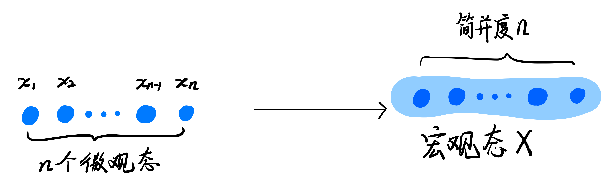
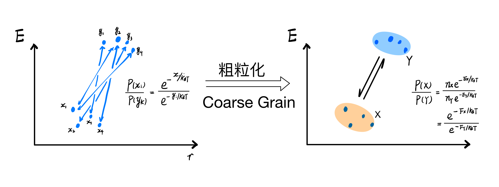
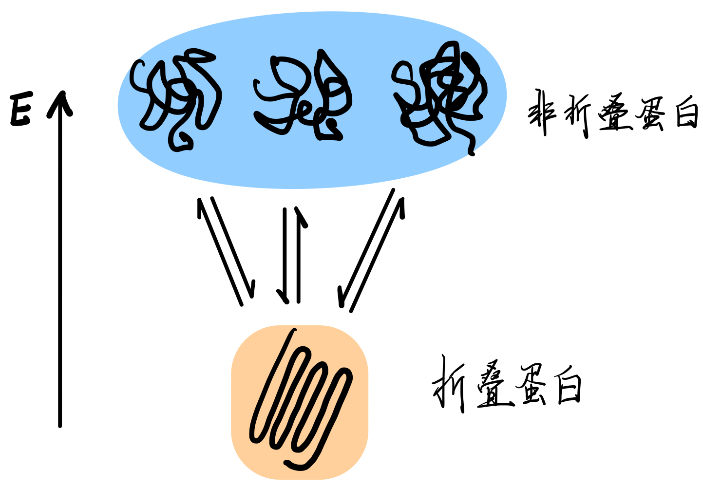
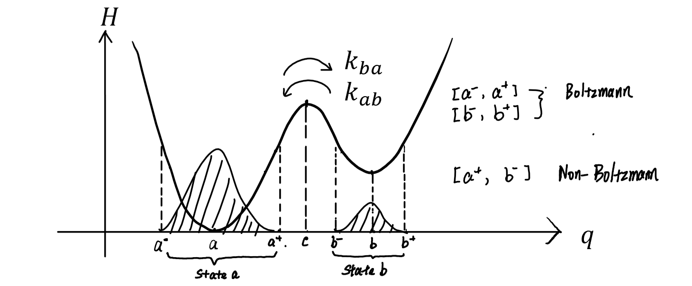

简并度字面上来说，就是简单被合并的自由度。

所以这其实是一个很直观的东西：本来有 n 个不同的微观态，如果我们并不想区分它们，那就可以把这些态合并成为一个“宏观”态。但是我们毕竟还是有这么多态的，所以在算概率的时候，我们需要用被合并的微观态的数量去乘上每个态的概率，得到一个我们并出来的态的概率。

> 注意，这里的宏观、微观是相对的概念，并不是绝对的概念。

<figure>
    
    

		<figcaption>图1. 简并度的粗粒化起源</figcaption>
    

</figure>

具体下，假设我们有 $\{x_1,x_2,\cdots,x_n\}$,这样一堆微观态，他们的能量都是 $E_X$ ，而我们其实不关心这些微观态有什么区别，那我们就把他们合并成一个 $X$ 的宏观态。在这个宏观态的概率就是所有这些微观态概率之和

$$
P(X)=\sum_{i}P(x_i)=\frac{1}{Z}n\exp\left[{-E_X/k_BT}\right]
$$

这里这个微观态数量$n$就是简并度了。

上面说的是一个略微特殊的情况，所有的微观态都有一模一样的能量。其实我们也可以合并一堆相似的但是没有那么相似的态。这里还是认为有 $\{x_1,x_2,\cdots,x_n\}$ 这么一堆态，每个态有自己的能量 $E_{x_i}$，那么我们的宏观态的概率是

$$
P(X)=\sum_{i}P(x_i)\simeq \frac{1}{Z} n\exp\left[{-\overline{E_X}/k_BT}\right]
$$

也就是简单的，这里用了一个所有微观态的平均能量 $\overline{E_X}$ ，这当然是个近似。而这个简并度我们可以丢到指数上面去

$$
P(X)\propto \exp\left[{-(\underbrace{\overline{E_X}-k_BT \ln n}_{F_X})/k_BT}\right]
$$

这里这个$F_x$ 可以被认为是宏观态$X$ 的“[[自由能]]”。这个自由能的定义就能让我们更方便地从微观解放出来，处理各种不同宏观态之间的关系了：

<figure>

</figure>
图2. 粗粒化与简并度

这里我们的横坐标 $r$ 就是一个可以用来区分不同微观态的自由度（特征），但是我们不是很在意区分某些态，于是我们使用粗粒化的方法，把整个系统划为两个宏观态 $X$ 和 $Y$ 。这个系统的动力学是描述的一堆微观态之间的跳转，而在粗粒化后，我们就只关心$X$ 和 $Y$ 之间的跳转。当系统达到平衡的时候，是由玻尔兹曼分布刻画的，这里就存在我们在粗粒化过程中丢不掉的东西，“简并度”。

> 一般我们认为，在宏观态之间内部的跳转是快的，于是宏观态先达到了内部的平衡。然后就可以在假设这个内部平衡的条件下，去描述两个宏观态之间的跳转。

## 一个例子：蛋白质折叠

再举一个更具象化的例子，考虑到一个蛋白质折叠的问题

图2. 蛋白质折叠的粗粒化处理

蛋白质的非折叠形态有很多的构象，这些不同的构象就是一个一个的“微观态”。但是我们并不关心其具体处在哪种构象，那就可以把所有可能的非折叠构象统称为一个“非折叠蛋白”的宏观态。接着我们关心的是这个“非折叠”宏观态和“折叠”宏观态之间的转换。

一个肽链分子在非折叠的状态下是很随意的，可以随意造型，这就带了非折叠态的极高的简并度。非折叠肽链的自由能是

$$
F_{非折叠}=E_{非折叠}-T\underbrace{k_B\ln n_{非折叠}}_{S_{非折叠}} 
$$

考虑到折叠状态是很规整的，我们忽略一下折叠状态的自由度，认为就一种构象，那么这个自由能就由这个能量给定了

$$
F_{折叠}=E_{折叠}
$$

虽然折叠态有更低的能量 $E$ ，但对于是非折叠态，其简并度贡献的熵让其在较高温度下反倒拥有了更低的自由能，那这时候蛋白质就趋向于非折叠的状态。

到更具体的例子，之前[友组工作](https://www.nature.com/articles/s41467-021-22818-5www.nature.com)也强调了简并度在早期生命演化过程中对核糖分子选择的作用

## 连续系统的简并度与粗粒化

再提一下一个连续系统中简单并度是怎么通过粗粒化来的。考虑一个双井势场，一个布朗粒子可以在热驱动下在这势能场中跑。

图4. 双势井的粗粒化

当我们系统达到平衡态的时候，这个平衡态是 $p(q)=\frac{1}{Z}e^{-H(q)/k_BT}$ 。而在达到这个平衡的过程中，系统的动力学 $\frac{d}{dt}p(x)=\cdots$ 是由一个被称为福克-普朗克方程描述的。如果我们去观察这个粒子，会发现它其实几乎不会停留在中间那个能量很高“山峰”上，而是几乎逗留在两个山谷里，然后偶尔从一个山谷跳到另一个山谷。那我们就不用关心整个空间的概率分布的演化，而可以粗略地认为这是一个在两个态（A和B）之间不断跳转的问题。注意到跨过这个山峰的过程是慢的，以至于粒子在山谷里的时候已经达到了一种热力学平衡，那在一个势井中的概率可以写为

$$
\begin{aligned} P(A) \propto\int_{-a}^{a}e^{-(H(q))/k_BT} dq &\simeq\int_{-a}^{a}e^{-H(a)/k_BT}e^{-\frac{1}{2}H''(q)(q-a)^2/k_BT}dq\\ &\simeq \frac{\sqrt{\pi}}{\sqrt{U''(a)}}e^{-H(a)/k_BT} \end{aligned}
$$

这里我们发现除了和这个势井能量相关的玻尔兹曼项，还有一个 $\frac{1}{\sqrt{U''(a)}}$ 。这一项就直接联系到了这个势井底部的曲率半径，表征了这个势井的“宽度”。这个宽度，也就是势井的“简并度”。而在我们粗粒化的时候，就把势井的“宽度”这个特征概括进了“简并度”里面。

统计物理中，我们对对象的描述总是粗粒化的。只要我们描述的东西有微观结构，那它就会有一个简并度。