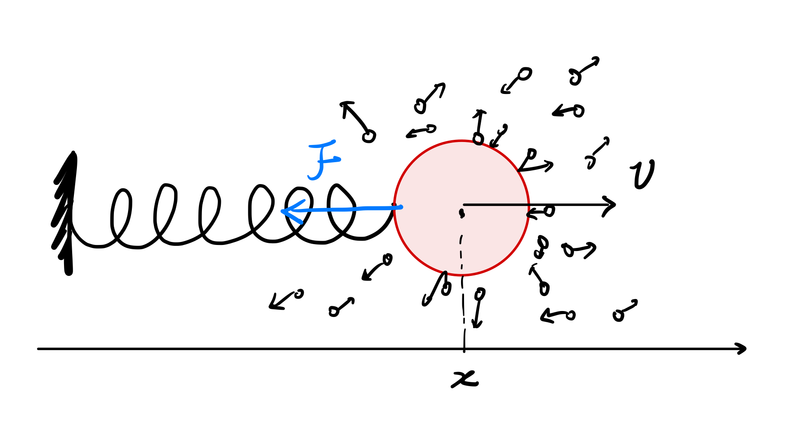

# 郎之万方程
## 从牛顿方程到Langevin方程

牛顿方程是经典物理下最直观的方程，其描述了一个物体在力的作用下的运动。
$$
\begin{cases}
\dot{x}=v\\
m\dot{v}=\sum_i f_i
\end{cases}
$$
在我们现实中接触的大部分场景来并不涉及接近光速的物理或者明显的量子效应，牛顿方程都可以视为最底层的理论。所以要描述一个东西的重点是找到所有的力。

不准求严谨性的来说，我们考虑水中悬浮的一个胶体颗粒，比如说一个花粉，其比周围的水分子大很多，于是会受到各个方向的水分子不断地碰撞。这些周围水分子不断碰撞的力我们只能用一个噪音项$\eta(t)$去刻画，那么这个花粉粒子的牛顿方程就写作

$$
m\dot v= \underbrace{F}_{宏观力}+\underbrace{\sum_i f_i^w}_{微观水分子碰撞}
$$

宏观力这一项很好理解，比如如上图所示的这个弹簧。宏观保守力都可以从一个势能场写出，那之后我们就把这部分写作$F=-\nabla U$. 而后面这个微观水分子碰撞有两个贡献
$$
\sum_i f_i^{w}=-\gamma v+\Gamma\eta(t)
$$
第一部分还是我们熟悉的内容：粘滞阻力。这一项正比与这个胶体颗粒的速度。这种正比关系也很好理解，因为颗粒有一个向前的速度，那对迎面撞来的水分子的动量改变量是$\Delta I_f =2v_w+v$, 而对从背后撞过来的水分子动量改变量是$\Delta I_b=2v_w-v$，两者的贡献合起来，就有了一个正比于颗粒速度的$-\gamma v$阻力。

而第二部分就是整个随机热力学的重点了，$\eta(t)$这一项被称为噪音项。这个噪音项由于是来自周围水分子的不断碰撞。考虑到这个溶液环境是均匀的，那么这些碰撞平均值应该为零，于是有了$\langle \eta(t)\rangle=0$, 这里我们用$\langle \rangle$表示求平均。而其更重要的一点性质是

$$
\langle \eta(t)\eta(t')\rangle =\delta (t-t')
$$

这个噪音提供的方差不为零，但是在不同时间点的噪音的相关性为零。

到这里，这噪音具体让系统有了什么样的变化还不是很清晰，我们还是先把完整的郎之万方程写出来，然后再慢慢分析。

$$
\begin{aligned}
欠阻尼郎之万方程\\
\text{(Underdamped LE)}
\end{aligned}
:
\quad 
\boxed{
\begin{cases}
\dot{x}=v\\
m\dot{v}=-\nabla U-\gamma v +\Gamma \eta(t)
\end{cases}
}
$$

这里为什么要提到欠阻尼呢？因为其实一般研究的更多的是“过阻尼郎之万方程”，也就是在一个粘滞性很高的溶液里，粒子的惯性相对于阻力可以忽略的情况: $m\dot{v}\to 0$。这中近似下的郎之万方程写作

$$
\begin{aligned}
过阻尼郎之万方程\\
\text{(Overdamped LE)}
\end{aligned}
:\quad 
\boxed{
\dot{x}=-\frac{1}{\gamma}\nabla U +\frac{\Gamma}{\gamma} \eta(t)
}
$$

> **宏观微观与介观**

## 郎之万方程的应用
### 扩散运动：Winner Process
说先我们思考一个传统的布朗粒子在水中的扩散过程。一个没有受到外力（保守力）的粒子，其郎之万方程写作
$$
\dot{x}=\frac{\Gamma}{\gamma}\eta(t)
$$

## 郎之万方程的微分形式

